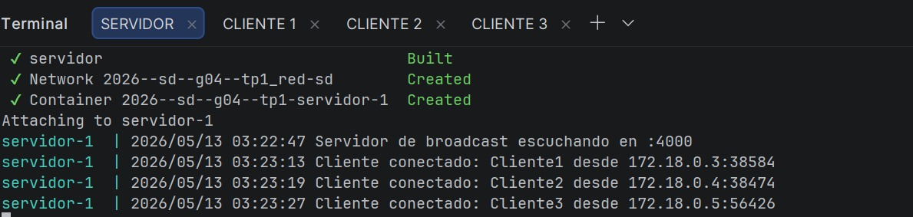
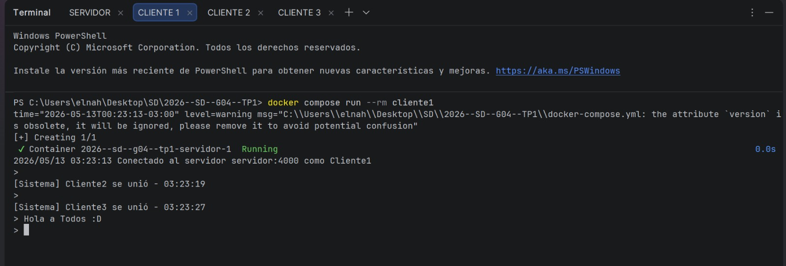
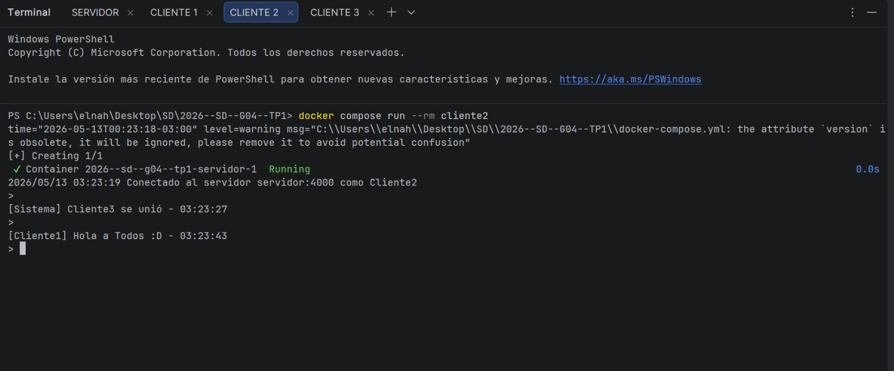
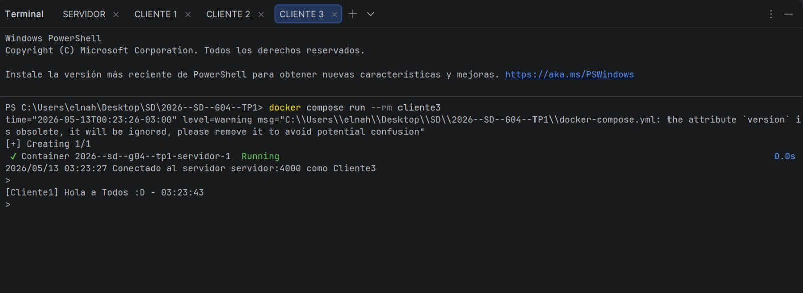

# Servidor de Broadcast Concurrente

Proyecto base para la Clase sobre Sockets de Sistemas Distribuidos.

## Integrantes

- Gallo, Guillermo Ariel
- Pedernera Theisen, Nahuel Thomas

## Ejecución

### Local

```bash
# Terminal 1: servidor
go run ./cmd/servidor

# Terminal 2: cliente
go run ./cmd/cliente
```

### Docker Compose

```bash
docker-compose up --build
```

## Requisitos completados

- [x] Servidor TCP concurrente
- [x] Protocolo JSON
- [x] Registro de clientes con sync.RWMutex
- [x] Broadcast a todos los clientes
- [x] Cliente interactivo (stdin + recepción paralela)
- [x] Docker + docker-compose
- [-] Bonus: descubrimiento UDP

## Captura de ejecución

A continuación se muestra una prueba de ejecución del sistema utilizando Docker Compose.  
En la primera terminal se observa el servidor TCP escuchando en el puerto `4000` y registrando la conexión de los clientes.  
Luego, en las terminales de los clientes, se verifica que cada uno se conecta correctamente al servidor mediante la dirección `servidor:4000`.

Durante la prueba se conectaron tres clientes simultáneamente. Al enviar un mensaje desde uno de ellos, el servidor lo recibe y lo reenvía a los demás clientes conectados, cumpliendo con el funcionamiento esperado del broadcast.



*Servidor TCP escuchando conexiones y registrando clientes conectados.*



*Cliente 1 conectado al servidor y enviando mensajes al sistema.*



*Cliente 2 conectado al servidor y recibiendo mensajes enviados por otros clientes.*



*Cliente 3 conectado al servidor y participando de la comunicación concurrente.*

